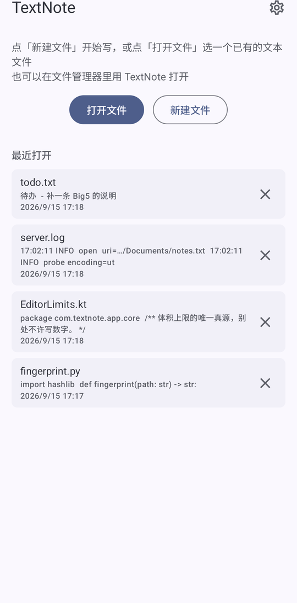
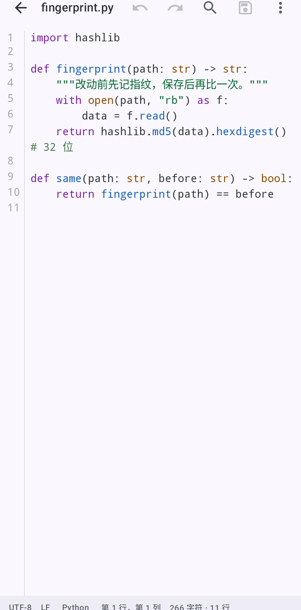
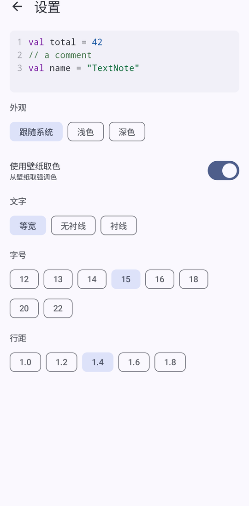

# TextNote

A lightweight Android text editor · byte-exact · Kotlin + Jetpack Compose + Material 3

**English** | [简体中文](README.zh-CN.md)

[](https://github.com/groundgrounder/TextNote/actions/workflows/android.yml)

<p>
  
  
  
</p>

TextNote is a plain-text editor built around a single rule — **fidelity**: open a file, take a
look, save it, and not one byte should have changed.

## Features

- **Byte-exact round trip**: encoding (UTF-8 / GB18030 / BOM) and line endings (LF / CRLF / CR)
  are detected on read and preserved on write; mixed endings are reported
- **Editing**: undo/redo with input coalescing, find and replace (regex / case / whole word /
  `$1` templates), `Ctrl+Z` and friends
- **Syntax highlighting**: 15 languages, picked by file extension, overridable per file and
  remembered
- **Large files**: past 200k characters a file switches to **read-only browsing**; past 4 MB it
  refuses to open rather than blow up memory
- **Nothing gets lost**: a draft is flushed the moment the app goes to the background; it only
  asks "restore / discard" when the draft actually differs from the file, and external changes
  are announced rather than applied behind your back
- **Looks**: follow system / light / dark, dynamic color; font family, size and line spacing;
  English · 简体中文 · 繁體中文

## Download

Grab the latest APK (`TextNote-vX.Y.Z.apk`) from
[Releases](https://github.com/groundgrounder/TextNote/releases/latest). minSdk 26 (Android 8.0+).

## Usage

- **Open file** goes through the system file picker; **New file** starts from scratch
- `.txt` / `.md` / `.log` / `.json` can also be opened straight from a file manager — just pick
  TextNote
- No storage permission is requested: every read and write goes through the picker's grant

## Known limits (deliberate trade-offs)

- Past 200k characters a file becomes read-only (a hand-rolled kernel of sora-editor's caliber
  is out of scope); no Markdown preview
- No bundled fonts — only the three system families; columns are counted in UTF-16 code units,
  so an emoji takes two
- Big5 is not detected separately: GB18030 covers its encoding space, and fidelity holds as long
  as the same encoding is written back

## Building from source

JDK 17 and the Android SDK (`sdk.dir` in `local.properties`).

```bash
./gradlew assembleDebug
adb install -r app/build/outputs/apk/debug/app-debug.apk
```

## Architecture

`core/` is pure Kotlin — no `androidx.compose.*`, no `android.*`, so it runs under a plain JVM.
`data/` holds SAF I/O and drafts; `ui/` is the Compose layer. The swappable kernel is enforced
by package boundaries rather than a fat interface: `ui/` only talks to `EditorViewModel`'s state.

## License

Copyright (C) 2026 groundgrounder

TextNote is free software: you can redistribute it and/or modify it under the terms of the
**GNU General Public License** as published by the Free Software Foundation, either version 3
of the License, or (at your option) any later version.

TextNote is distributed in the hope that it will be useful, but WITHOUT ANY WARRANTY; without
even the implied warranty of MERCHANTABILITY or FITNESS FOR A PARTICULAR PURPOSE. See the
[GNU General Public License](https://www.gnu.org/licenses/gpl-3.0.html) for more details.
